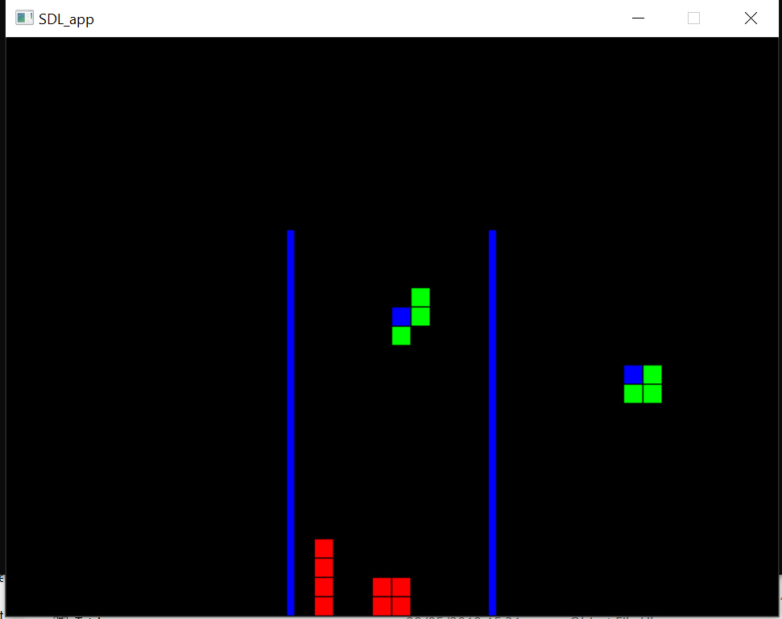

# Tetris
---
Tetris tutorial in C++ from [here](http://javilop.com/gamedev/tetris-tutorial-in-c-platform-independent-focused-in-game-logic-for-beginners/)

## Controls
---
* Down arrow  	Drops piece
* Up arrow		Rotates block
* X				Drops piece

## Tested Versions
---

* windows Visual Studio 2017